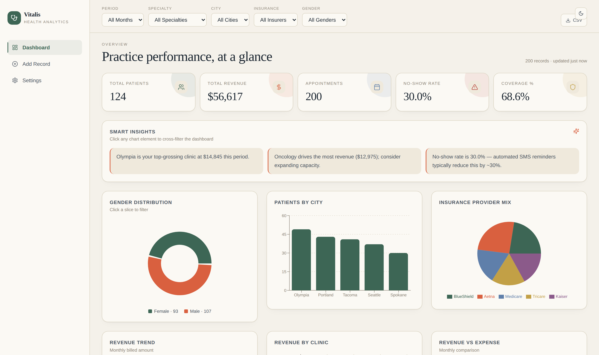
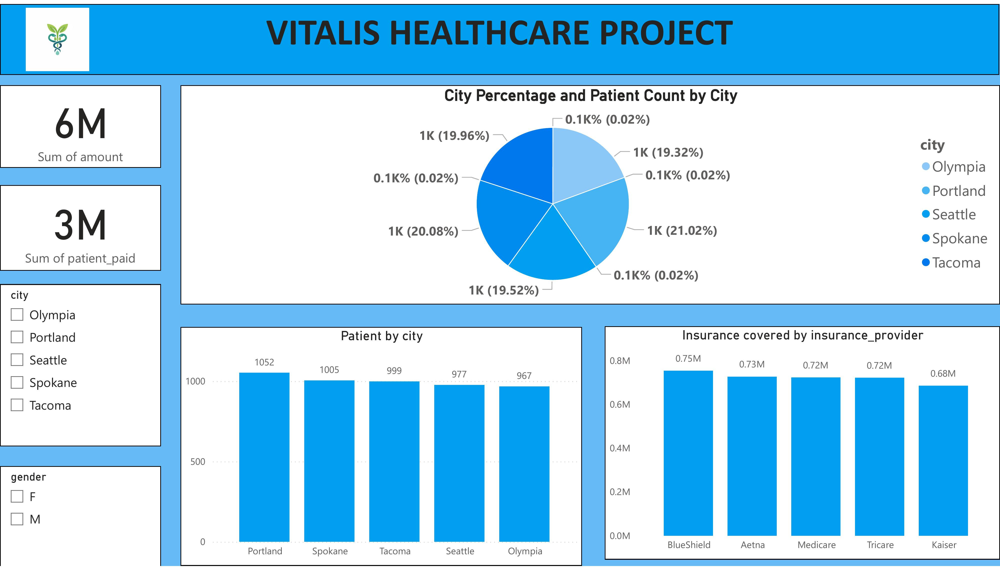
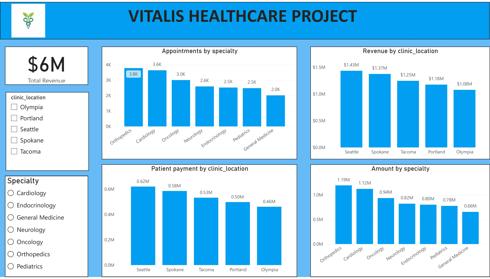
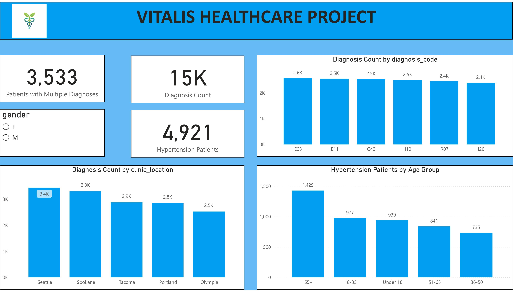
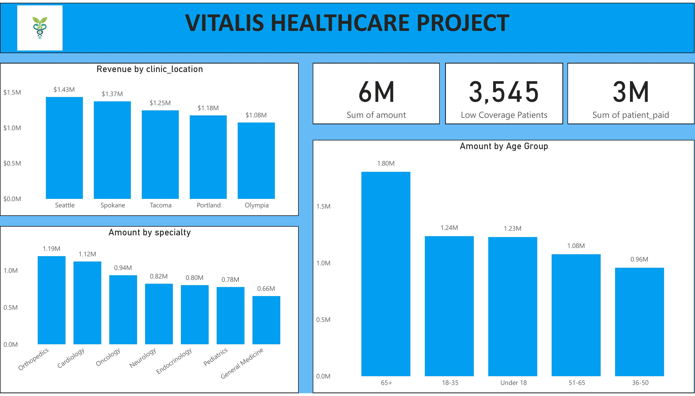
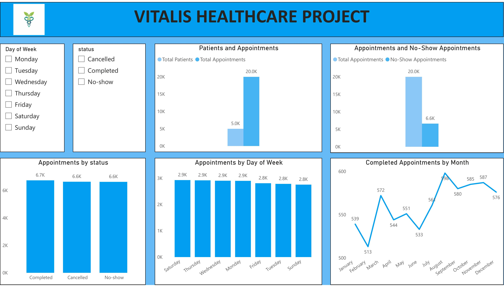
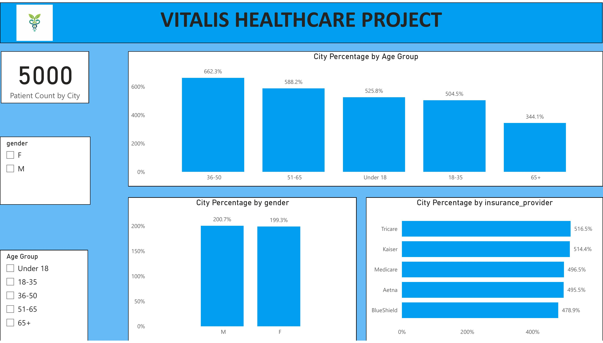

<div align="center">

# Vitalis Healthcare Project

**Healthcare data, transformed into decisions.**

End-to-end healthcare analytics — from raw SQL to a polished React web app.

</div>



<div align="center">

### 🔗 Live links

[**📊 View Power BI Dashboard (live)**](https://app.powerbi.com/links/SsuRswiz5q?ctid=74283479-689a-49e8-9a3b-d4098db086cb&pbi_source=linkShare) ·
[**📄 Read Documentation (PDF)**](docs/Vitalis-Project-Documentation.pdf) ·
[**🗄️ View SQL Queries**](sql/healthcare_queries.sql)

*Web app live URL coming soon — see [Deployment](#deployment) to publish it yourself.*

</div>

---

> **A note on GitHub previews.** GitHub renders Markdown, PDFs, images, and SQL inline. It does **not** preview PowerPoint, Power BI workbook files, HTML pages, or ZIPs in the browser — those files **download to your computer when you click them**. This is normal. Each link below tells you what to expect.

---

## Table of Contents

- [About the project](#about-the-project)
- [Live demos & downloads](#live-demos--downloads)
- [Headline findings](#headline-findings)
- [Dashboards](#dashboards)
- [Repository structure](#repository-structure)
- [Deployment](#deployment)
- [Run it locally](#run-it-locally)
- [Key insights](#key-insights)
- [Recommendations](#recommendations)
- [Tech stack](#tech-stack)
- [Contributing](#contributing)
- [License](#license)

---

## About the project

Vitalis is a healthcare analytics project that turns patient, financial, and operational data into actionable insights. It uses a synthetic dataset of **20,000 appointments across 5 clinic locations** to demonstrate three complementary views of the same underlying data:

1. **PostgreSQL queries** that answer business questions for analysts
2. **Power BI dashboards** that give executives a real-time view of the practice
3. **A React web app** that mirrors the Power BI experience in a browser

The project is designed to be a portfolio piece: each layer is self-contained, well-documented, and can be reviewed independently.

---

## Live demos & downloads

### 📊 Power BI dashboard — live

The interactive Power BI dashboard is published and viewable in your browser:

🔗 **Live link:** https://app.powerbi.com/links/SsuRswiz5q?ctid=74283479-689a-49e8-9a3b-d4098db086cb&pbi_source=linkShare

Click and it opens directly in Power BI. No download, no installation.

Prefer to edit the workbook in Power BI Desktop? Download the raw file:
[`powerbi/HEALTHCARE_PROJECT.pbix`](powerbi/HEALTHCARE_PROJECT.pbix) (downloads when clicked; ~2 MB)

### 📄 Documentation

| File | Click to… |
|------|-----------|
| [`docs/Vitalis-Project-Documentation.pdf`](docs/Vitalis-Project-Documentation.pdf) | ✅ View 14 slides directly on GitHub |
| [`docs/Vitalis-Project-Documentation.pptx`](docs/Vitalis-Project-Documentation.pptx) | 📥 Download editable PowerPoint |

### 🌐 Vitalis web app

| File | Click to… | Then… |
|------|-----------|-------|
| [`web/vitalis.html`](web/vitalis.html) | 📥 Click "Download raw file" top-right of the source view | Double-click the saved file — opens in your browser |
| [`web/vitalis-source.zip`](web/vitalis-source.zip) | 📥 Download Vite source (74 KB) | Unzip, `npm install`, `npm run dev` |
| [`web/vitalis-netlify-deploy.zip`](web/vitalis-netlify-deploy.zip) | 📥 Download deployment bundle (217 KB) | See the [Deployment section](#deployment) below |

### 🗄️ SQL queries

[`sql/healthcare_queries.sql`](sql/healthcare_queries.sql) — ✅ renders inline on GitHub with syntax highlighting.

---

## Headline findings

| Metric                              | Value         | Note                                                 |
| ----------------------------------- | ------------- | ---------------------------------------------------- |
| Total revenue                       | **$6M**       | across 20,000 appointments                           |
| No-show rate                        | **33%**       | ~6.6K missed appointments — major operational drag   |
| Top clinic by revenue               | **Seattle**   | $1.43M, ~32% ahead of lowest (Olympia)               |
| Top specialty by revenue            | **Orthopedics** | $1.19M; Cardiology a close second ($1.12M)        |
| Patients with hypertension          | **4,921**     | 98% of the active patient base                       |
| Patients with multiple diagnoses    | **3,533**     | significant chronic care burden                      |
| Highest-spending age cohort         | **65+**       | $1.80M in billed amount                              |

---

## Dashboards

Six dashboard pages from the Power BI workbook. Click any image to view full size — or [open the live Power BI](https://app.powerbi.com/links/SsuRswiz5q?ctid=74283479-689a-49e8-9a3b-d4098db086cb&pbi_source=linkShare) to interact with them.

### 1. Patient demographics
*Who are the patients? Where do they live?*

[](docs/screenshots/01-demographics.jpg)

### 2. Specialty performance
*Which medical specialties generate the most revenue and activity?*

[](docs/screenshots/02-specialty.jpg)

### 3. Diagnosis analysis
*What conditions do the patients have?*

[](docs/screenshots/03-diagnosis.jpg)

### 4. Financial summary
*How does the money flow through the practice?*

[](docs/screenshots/04-financial.jpg)

### 5. Appointment operations
*How does the practice run day-to-day?*

[](docs/screenshots/05-appointments.jpg)

### 6. Patient population profile
*How is the patient base distributed across cohorts?*

[](docs/screenshots/06-patient.jpg)

> 📄 For the full narrative behind each dashboard, see [the documentation PDF](docs/Vitalis-Project-Documentation.pdf).

---

## Repository structure

```
vitalis-healthcare/
│
├── README.md                       This file
├── LICENSE                         MIT
├── CONTRIBUTING.md                 How to contribute
├── GITHUB-SETUP.md                 Step-by-step guide to publish this repo
├── .gitignore
│
├── docs/                           Project documentation
│   ├── Vitalis-Project-Documentation.pdf    ← renders inline on GitHub
│   ├── Vitalis-Project-Documentation.pptx   ← editable PowerPoint
│   └── screenshots/                Dashboard + hero screenshots
│
├── sql/                            SQL deliverable
│   └── healthcare_queries.sql      17 analytical queries
│
├── powerbi/                        Power BI deliverable
│   └── HEALTHCARE_PROJECT.pbix     The interactive workbook
│
└── web/                            Vitalis web app
    ├── vitalis.html                Single-file build (run in browser)
    ├── vitalis-source.zip          Vite project source
    └── vitalis-netlify-deploy.zip  Drag-and-drop deployment bundle
```

---

## Deployment

### Power BI dashboard — already deployed ✅

The Power BI report is published and live at:
https://app.powerbi.com/links/SsuRswiz5q?ctid=74283479-689a-49e8-9a3b-d4098db086cb&pbi_source=linkShare

### Web app — deploy in 90 seconds (Netlify Drop)

1. Download [`web/vitalis-netlify-deploy.zip`](web/vitalis-netlify-deploy.zip) from this repo
2. Unzip it on your computer
3. Open [app.netlify.com/drop](https://app.netlify.com/drop) in your browser
4. Drag the unzipped folder onto the drop area
5. Netlify gives you a public URL like `vitalis-abc123.netlify.app`
6. Update this README: replace the *"Web app live URL coming soon"* line near the top with your new URL

Alternatives: deploy with `npx vercel` from the unzipped Vite source, or push the build to GitHub Pages — see [`GITHUB-SETUP.md`](GITHUB-SETUP.md).

---

## Run it locally

If you'd rather develop locally than deploy:

```bash
# 1. Clone
git clone https://github.com/<YOUR-USERNAME>/vitalis-healthcare.git
cd vitalis-healthcare

# 2. SQL — load schema and queries into PostgreSQL
psql -d your_database -f sql/healthcare_queries.sql

# 3. Power BI — double-click powerbi/HEALTHCARE_PROJECT.pbix

# 4. Web app dev server
unzip web/vitalis-source.zip -d web/vitalis
cd web/vitalis
npm install
npm run dev
# → http://localhost:5173
```

---

## Key insights

1. **Revenue concentration.** Seattle generates 24% of total revenue ($1.43M). The bottom clinic (Olympia) generates 18%. Closing the gap is a $350K opportunity per location.

2. **No-show rate is the biggest operational drag.** 33% of appointments are missed. Automated reminders typically cut this by ~30%, recovering significant capacity.

3. **Chronic conditions dominate.** 4,921 of 5,000 patients carry a hypertension diagnosis. 3,533 carry more than one chronic condition. Coordinated care programs would reduce repeat visits and complications.

4. **High-margin specialties.** Orthopedics ($1.19M) and Cardiology ($1.12M) together drive 39% of revenue. Capacity expansion here yields more than expanding lower-margin General Medicine ($0.66M).

5. **Aging population skews cost.** Patients aged 65+ generate $1.80M in billed amount — the highest of any age group. Preventive screening programs reduce long-term cost.

---

## Recommendations

| Priority | Action                                  | Expected impact                                    |
| -------- | --------------------------------------- | -------------------------------------------------- |
| 01       | Reduce no-show rates                    | Recover capacity through SMS/email reminders       |
| 02       | Strengthen chronic disease management   | Fewer repeat visits, better outcomes               |
| 03       | Invest in Orthopedics + Cardiology      | Sustain and grow the highest-revenue specialties   |
| 04       | Audit lower-revenue locations           | Close the gap with Seattle                         |
| 05       | Expand preventive care for 65+          | Manage long-term cost, improve outcomes            |

Full discussion in [the documentation deck](docs/Vitalis-Project-Documentation.pdf).

---

## Tech stack

| Layer            | Technologies                                                |
| ---------------- | ----------------------------------------------------------- |
| **Data**         | PostgreSQL 14+                                              |
| **Analytics**    | Power BI Desktop + Power BI Service                         |
| **Web app**      | React 18, Vite 5, Tailwind CSS, Recharts, Framer Motion     |
| **Persistence**  | LocalStorage (web app), file-based (.pbix, .sql)            |
| **Tooling**      | npm, Git                                                    |

---

## Contributing

Contributions, corrections, and forks are welcome. See [**CONTRIBUTING.md**](CONTRIBUTING.md) for guidelines.

---

## License

This project is licensed under the MIT License — see [**LICENSE**](LICENSE) for details.

---

<div align="center">

**Quick access**

[📊 Live Power BI](https://app.powerbi.com/links/SsuRswiz5q?ctid=74283479-689a-49e8-9a3b-d4098db086cb&pbi_source=linkShare) ·
[📄 Documentation PDF](docs/Vitalis-Project-Documentation.pdf) ·
[🌐 Web app source](web/vitalis-source.zip) ·
[🗄️ SQL queries](sql/healthcare_queries.sql)

</div>
